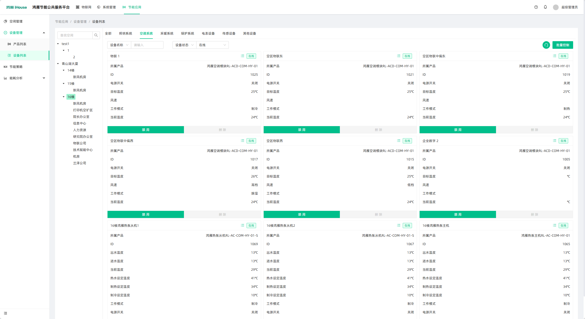
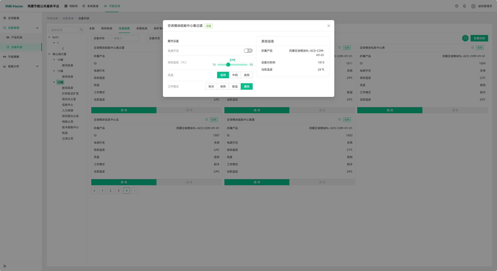
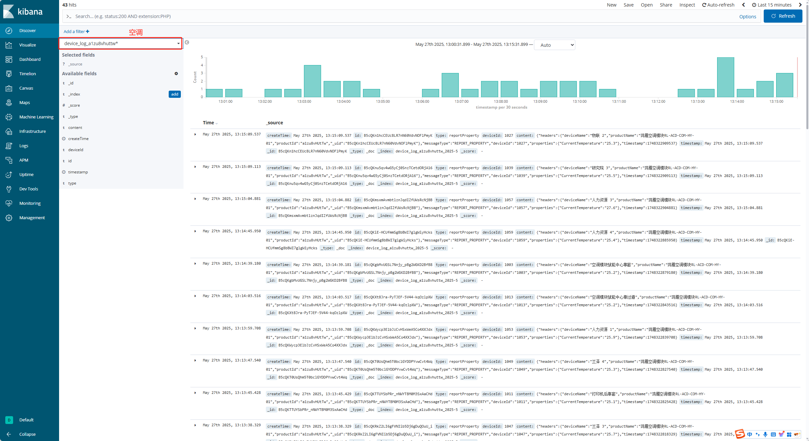

# 物联平台对接说明

本说明文档介绍如何使用物联平台进行设备查看、数据查询及接口控制设备，适用于开发、测试与运维人员。

## 1. 使用管理后台查设备信息

1. 打开**物联管理后台**地址`http://172.30.8.113:9000`
2. 使用分配的账号密码登录
3. 登录后可进入 **节能应用** ，【设备管理】-【设备列表】查看设备列表、在线状态、最新上报数据



## 2. 使用Kibana查看设备数据

####  2.1 访问 Kibana

1. 打开**Kibana**平台后台地址`http://172.30.8.113:5601`



## 3. 使用接口从ES查设备数据
#### 请求方式

`POST` 或 `GET`（推荐使用 `POST`，带查询体）

#### 请求地址格式

```
http://172.30.8.113:9200/<索引名称>/_search
```
#### 示例
```
POST http://localhost:9200/device_log_a1zu8vHUtTw_2024-12/_search
```

> 说明：索引名称格式为：`device_log_{productId}_{yyyy-MM}`  
> 示例中：空调产品 ID 为 `a1zu8vHUtTw`，时间为 `2024-12`。


#### 请求参数（Body）

```json
{
  "query": {
    "term": {
      "deviceId": "1063"
    }
  },
  "sort": [
    {
      "timestamp": {
        "order": "desc"
      }
    }
  ],
  "size": 10
}
```

#### 参数说明：

| 字段       | 类型   | 说明                                           |
|------------|--------|------------------------------------------------|
| query.term.deviceId | string | 要查询的设备 ID，精确匹配                   |
| sort.timestamp.order | string | 按上报时间排序，`desc` 表示按时间倒序        |
| size       | int    | 返回结果数量，最大推荐不超过 100 条             |


#### 返回示例（部分字段）

```json
{
  "hits": {
    "total": 999,
    "hits": [
      {
        "_index": "device_log_a1zu8vHUtTw_2024-12",
        "_id": "abc123",
        "_source": {
          "deviceId": "1063",
          "type": "reportProperty",
          "content": "{...}",         
          "timestamp": 1733557941464
        }
      }
    ]
  }
}
```


#### content 字段说明（嵌套 JSON）

该字段内部是字符串形式的 JSON，可解析为如下结构：

```json
{
  "headers": {
    "deviceName": "人力资源 6",
    "productId": "a1zu8vHUtTw",
    "productName": "鸿雁空调模块RL-ACD-COM-HY-01"
  },
  "messageType": "REPORT_PROPERTY",
  "deviceId": "1063",
  "properties": {
    "CurrentTemperature": 17.0
  },
  "timestamp": 1733557941464
}
```


#### 注意事项

- 若未指定 `body` 查询参数，默认会返回整个索引下的所有设备数据，查询效率低下。
- 建议分页查询或使用 `search_after` 方式进行游标查询（适用于大数据量）。
- 请确保所查询的设备 `deviceId` 与存储字段类型匹配（如为 `keyword` 类型时应使用 `term` 查询）。
- 时间字段（如 `timestamp`）为 `Long` 类型的毫秒时间戳，可根据业务需要转换为可读时间。

## 4. 物联平台API

### 登录获取token

登录后拿到token

POST http://172.30.8.113:9000/api/authorize/login

请求报文
```json
{
    "username": "*****",
    "password": "*****",
    "remember": true,
    "expires": 3600000,
    "verifyCode": "",
    "verifyKey": ""
}
```

返回报文
```json
{
    "message": "success",
    "result": {
        "expires": 3600000,
        "permissions": [
            
        ],
        "roles": [
            
        ],
        "userId": "344608d54b4cdddb6f943e14b399b159",
        "user": {
           
        },
        "currentAuthority": [
          
        ],
        "token": "78191b6ee7419c97880bc**********"
    },
    "status": 200,
    "timestamp": 1748324981401
}
```

### 查询设备最新属性
GET http://172.30.8.113:9000/api/device-instance/{deviceId}/properties/latest

```json
GET http://172.30.8.113:9000/api/device-instance/000D6F0012F98E3D/properties/latest
```

```json
{
    "message": "success",
    "result": [
        {
            "id": "B5cPJP0s2klV2KKYZ5sS7GTFv-WwNoDT",
            "deviceId": "000D6F0012F98E3D",
            "property": "Switch",
            "propertyName": "开关",
            "type": "boolean",
            "value": true,
            "formatValue": "是",
            "createTime": 1748305771820,
            "timestamp": 1748305771820
        },
        {
            "id": "B5bMt8skXkgAmc1dFq9qYe0h0QuDKmBo",
            "deviceId": "000D6F0012F98E3D",
            "property": "Status",
            "propertyName": "网络状态",
            "type": "enum",
            "value": "0",
            "formatValue": "正常",
            "createTime": 1747191319332,
            "timestamp": 1747191319332
        },
        {
            "id": "B5bMt8slsZaHRuBXCBPmMgxzinsb1eeq",
            "deviceId": "000D6F0012F98E3D",
            "property": "FirmwareVersion",
            "propertyName": "设备固件版本",
            "type": "string",
            "value": "20171129",
            "formatValue": "20171129",
            "createTime": 1747191319333,
            "timestamp": 1747191319333
        }
    ],
    "status": 200,
    "timestamp": 1748325950686
}
```

### 发送设备控制指令

POST http://172.30.8.113:9000/api/device-instance/{id}/property

```json
{"PowerSwitch":"true"}
```

```json
{
    "message": "设备已离线",
    "status": 500,
    "code": "client_offline",
    "timestamp": 1748326634642
}
```
